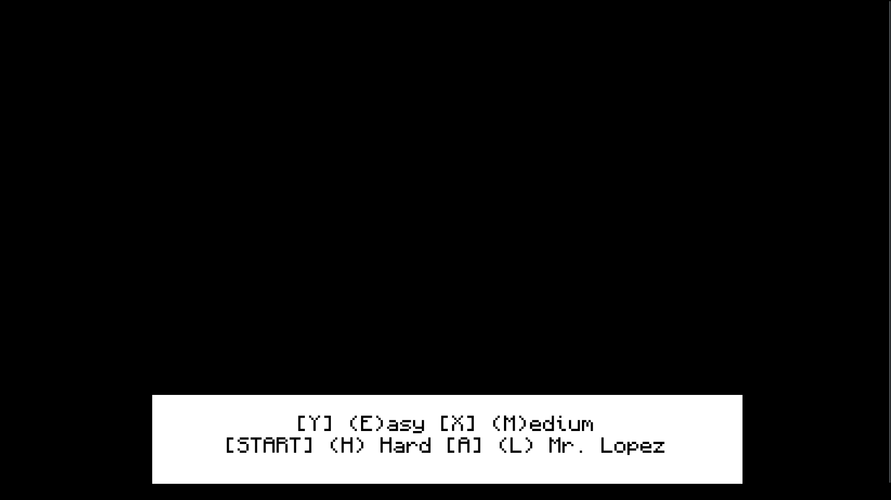
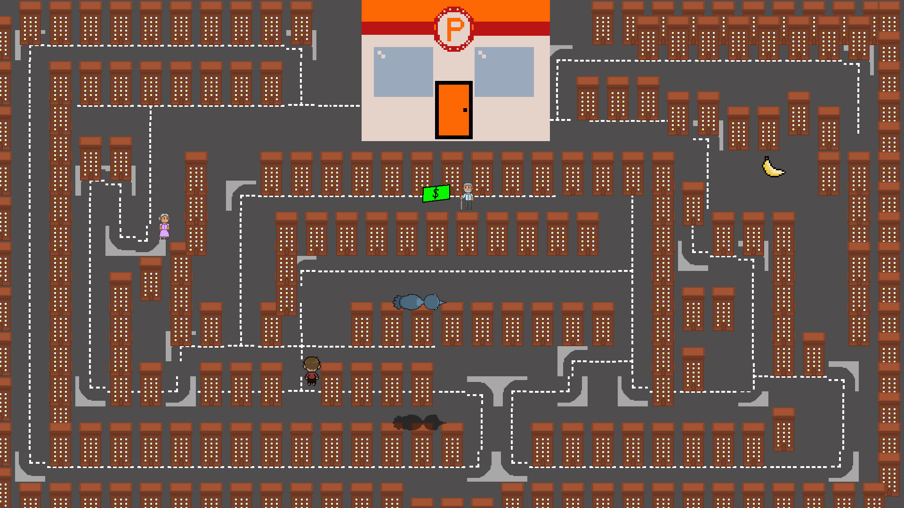
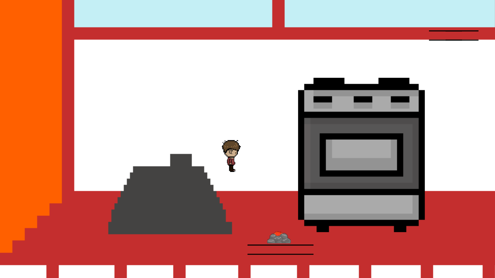

# come_hell_or_high_water
A 2D GameMaker game with a stream of consciousness flow of random ideas from a diverse and nuanced population of individuals.

## Features
- 2D maze game with boss battle
- 2D platformer with interesting physics
- difficulty choices that meaningfully affect gameplay (especially at the hardest difficulty)
- controller support!

## Screenshots

## Sounds
All sounds used are credit in [sounds.md](./sounds/sounds.md).

## Buliding
Compiling is confusing; the last confirmed version tested on Linux for GX.games is v2024.200.0.494. The last working Windows build was from December 2023. The current November 2024 build doesn't compile.

## License
The project uses the [MIT License](https://mit-license.org/).
